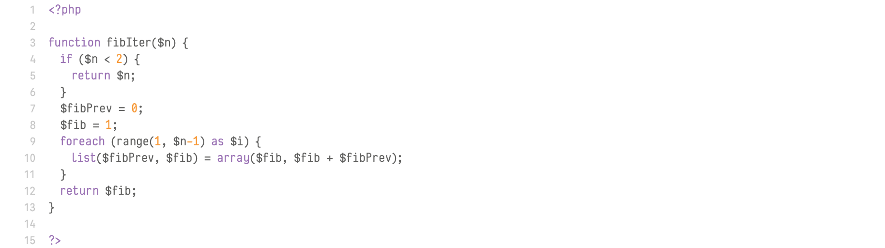
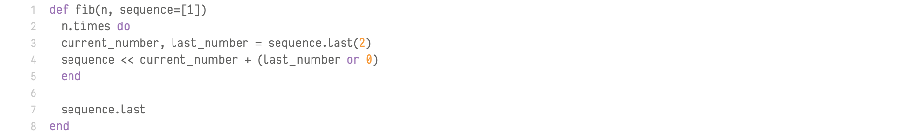
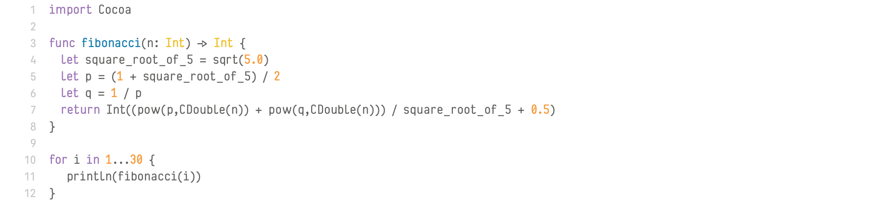

# NF-Code

## Features

### Font design

NF Code is design around clarity and readability, even at small sizes.

Unless most coding fonts, it features:
* variable width,
* ligatures.

The font is still young, and it will improve over time.

### Weights

NF Code only features Regular weight at the moment, but more is planned!

- [x] Regular (#1)
- [ ] Bold (#2)
- [ ] Italic (#3)
- [ ] Bold italic (#4)

### Ligatures

NF Code has some ligatures, dedicated to code readability.

Their purpose is to display real mathematical operators (≠, ≤, ≥…), group some characters together (//, ->…) or improve reading (#TODO, [WARN], [ERROR]…).

## Installation

The easiest way to get the last version is to get files from the [releases page](https://github.com/sgigou/NF-Pixels/releases).

You will find `ttf` and `otf` files in the [fonts directory](fonts/).

You may also take a look at the [sources folder](sources) to find the work files.

If you want some examples, you can go to the [showcases directory](showcases) to see the table of characters, and some real-life examples.

## Examples

### All chars

### Ligatures

### C++

### HTML

### PHP

### Ruby

### Swift

## License

This font is under [SIL Open Font License 1.1](LICENSE)

## Credits

* Steve Gigou ([Github](https://github.com/sgigou), [Website](https://steve.gigou.fr), [Twitter](https://twitter.com/stevegigou))

