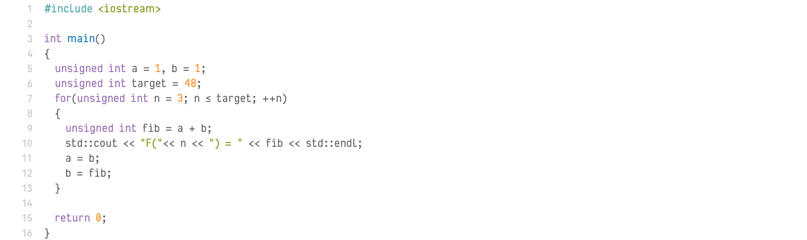

# NF-Code

## Features

### Font design

### Weights

### Ligatures

## Installation

## Examples

### All chars

### Ligatures

### C++

### HTML

### PHP

### Ruby

### Swift

## License

## Credits